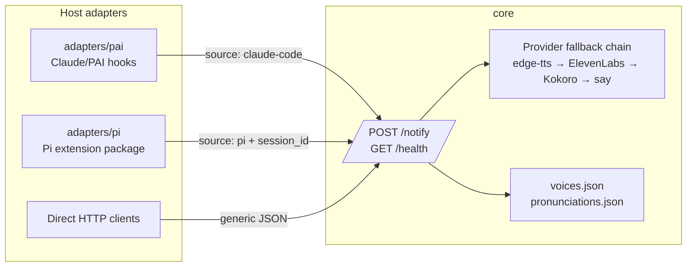

# feat: Add Pi agent adapter and universal host split

## Overview

Convert `atlas-voicesystem` from a PAI-shaped voice server bundle into a host-neutral voice server with explicit host adapters, then add Pi as the first non-PAI adapter. The universal core continues to provide the existing `/notify` contract on port `8888`; PAI- and Pi-specific lifecycle integration lives outside the core under `adapters/`.

This plan intentionally combines the foundational issue #1 decoupling with issue #7's Pi adapter work. A Pi adapter would otherwise have nowhere clean to plug in, and adding it directly to the current PAI-shaped tree would bake in the coupling this repo is trying to remove.

---

## Problem Frame

`SCOUT-REPORT.md` confirms the current daemon works and the running server is healthy, but the repo is pre-decoupling:

- The real server files live under `claudecode/.claude/PAI/USER/Voice/`, even though the server's intended identity is host-neutral.
- The daemon is mostly generic, but `server.ts`, scripts, docs, and service names still contain PAI-branded defaults and legacy compatibility routes.
- The existing PAI hooks already model the desired adapter behavior: greet on session start, speak response completion, and suppress subagent floods.
- Pi exposes a package/extension system and lifecycle events that can support the same adapter pattern without changing the server core.

The intended outcome is: install/run the voice server without PAI, opt into `adapters/pai/` or `adapters/pi/` independently, and preserve current PAI behavior while proving the universal-server model with Pi.

---

## Requirements Trace

- R1. Universal core must not depend on PAI, Pi, Claude Code, or any host-specific settings files.
- R2. The `/notify` HTTP contract, default port `8888`, rate limiting, sanitization, provider fallback, voice settings resolution, and health reporting must remain compatible.
- R3. Existing PAI integration must keep working after migration through `adapters/pai/`, including session-start greeting, stop-phase `🗣️` line speaking, and subagent voice suppression.
- R4. Pi integration must be a Pi package/extension under `adapters/pi/` that can be installed without PAI present.
- R5. Pi session-start should trigger an audible greeting through `/notify` using Pi session metadata and `source: "pi"`.
- R6. Pi response-complete handling should speak the final `🗣️` line when present, without speaking generic assistant text.
- R7. Pi subagent or child-agent contexts must not flood the voice server with duplicate greetings or completion speech.
- R8. Install flow must support core-only, PAI adapter, and Pi adapter installs without hand-editing host settings.
- R9. The conversion must account for the dirty migration surface: `MIGRATIONS.md` and `scripts/restore-hooks.ts` are already mid-change and must not be overwritten blindly.
- R10. Documentation must explain the new layout, host adapter model, Pi install path, and how future adapters should follow the Pi example.
- R11. Because there are no existing tests, implementation must add characterization/smoke coverage before or alongside behavior-moving work.

---

## Scope Boundaries

- Do not change the `/notify` request body, response status semantics, or default port.
- Do not add Pi-specific logic to the universal server core.
- Do not implement OpenCode, Gemini CLI, Cursor, or other host adapters in this pass.
- Do not publish the npm package from issue #8 in this pass.
- Do not add new TTS providers or change provider priority beyond what is required by file relocation.
- Do not solve the historical catchphrase investigation except where a universal/Pi catchphrase fallback is needed.
- Do not require PAI files for core-only or Pi installs.

### Deferred to Follow-Up Work

- NPM one-command packaging from issue #8.
- Full docs polish for all of issues #2-#5 beyond the sections needed for this conversion.
- OpenCode adapter and other future host adapters.
- Broader refactors of provider internals that are not required for safe extraction.

---

## Context & Research

### Relevant Code and Patterns

- `claudecode/.claude/PAI/USER/Voice/server.ts` contains the universal provider chain, circuit breakers, sanitization, `/notify` endpoint, `/health`, and existing `session_id` / `source` logging fields that Pi should use.
- `claudecode/.claude/PAI/USER/Voice/hooks/VoiceGreeting.hook.ts` is the main pattern for session-start greeting and layered duplicate suppression.
- `claudecode/.claude/PAI/USER/Voice/hooks/handlers/VoiceNotification.ts` is the pattern for validating and speaking a final `🗣️` completion line.
- `claudecode/.claude/PAI/USER/Voice/hooks/VoiceGate.hook.ts` is the pattern for blocking subagent voice curls.
- `claudecode/.claude/PAI/USER/Voice/hooks/lib/paths.ts`, `identity.ts`, `hook-logger.ts`, `output-validators.ts`, and `time.ts` are PAI adapter helpers, not universal-core helpers.
- `scripts/restore-hooks.ts` is an untracked, already-authored PAI hook-registration reapply script. It should move with or delegate to the PAI adapter rather than being overwritten.
- `claudecode/.claude/PAI/USER/Voice/README.md` is a stale secondary documentation surface and must be updated, moved, or replaced by a pointer to root docs.
- `voices.json` currently references `./voices-schema.json`, but that schema file does not exist.

### Pi Extension Findings

- Pi 0.78.0 is installed and uses the `@earendil-works/pi-coding-agent` import scope in current extensions.
- Pi packages can be installed from local paths with `pi install ./local/path`; package manifests declare resources under the `pi` key, for example `pi.extensions`.
- Pi lifecycle events relevant to the adapter include `session_start`, `session_shutdown`, `message_end`, `turn_end`, `tool_call`, `tool_result`, `agent_start`, and `agent_end`.
- Pi session identity can be obtained through the extension context's session manager (`getSessionFile()` / `getSessionId()` patterns already used by installed extensions).
- Pi subagent tooling sets environment markers such as `PI_SUBAGENT_CHILD`, `PI_SUBAGENT_FANOUT_CHILD`, and parent run variables. The adapter should use those as suppression signals.

### Scout Delta / Gaps Found Beyond `SCOUT-REPORT.md`

- The first draft said to preserve `/pai` in core; that conflicts with issue #1's goal that universal core contain no PAI knowledge. The final plan treats `/pai` as a PAI-adapter migration concern, not a core route.
- Service identity is also coupled: scripts use PAI-branded LaunchAgent/log names. A universal install needs a neutral service identity and a migration path for the old service.
- The secondary Voice README is stale and references paths that do not match the current repo layout.
- Pi should be packaged as a Pi extension package, not just a script directory.
- Pi adapter configuration cannot depend on PAI `settings.json` / `daidentity`; it needs independent defaults and optional config.
- Core extraction should either add the missing voice schema or remove/fix the stale schema reference.
- Edge TTS temp cleanup currently calls `unlinkSync` without importing it, so cleanup silently fails; this is not required for Pi, but should be characterized or fixed while adding core tests.

### Institutional Learnings

- `SCOUT-REPORT.md` records that prior stow conflicts and PAI migration scripts are fragile. Treat install and migration paths as high-risk.
- The phantom-voice investigation concluded the audio architecture is sound; current work is fit/ergonomics, not race-condition repair.

### External References

- Pi CLI help (`pi --help`, `pi install --help`) for package installation and extension loading behavior.
- Installed Pi extension/package documentation for lifecycle event names and package manifest conventions.
- GitHub issues #1, #2, #3, #4, #5, #7, and #8 for roadmap dependencies and acceptance criteria.

---

## Key Technical Decisions

- **Use `core/` + `adapters/` layout:** Keeps the universal daemon clearly separated from host lifecycle integrations and matches issue #1's direction.
- **Make adapters out-of-process `/notify` clients:** The core server does not load host adapters or register host-specific routes. Each adapter translates host lifecycle events into `/notify` payloads.
- **Remove PAI knowledge from core, not from the repo:** PAI-specific code remains supported under `adapters/pai/`; only `core/` must be host-neutral.
- **Treat `/pai` as deprecated adapter compatibility:** Current PAI integration already uses `/notify`; the plan should not keep a PAI-named core route just for historical callers. If implementation finds active callers still using `/pai`, migrate them in the PAI adapter or document a transitional adapter-side shim.
- **Use a neutral service identity with migration:** New installs should use a neutral LaunchAgent/log naming scheme; install should detect and unload/remove the old PAI-named service when migrating.
- **Package Pi as a local Pi package:** `adapters/pi/package.json` should declare `pi.extensions`, so `pi install ./adapters/pi` or the repo installer can register it through Pi's own package mechanism.
- **Do not read PAI settings from Pi:** Pi adapter uses its own config defaults: endpoint, title, catchphrase, optional `voice_id`, and suppression behavior.
- **Prefer characterization-first for moved behavior:** Before moving PAI hooks and core server behavior, add tests/smoke coverage around payload formation, route semantics, and hook decisions.

---

## Open Questions

### Resolved During Planning

- **Should this plan include both decoupling and Pi adapter work?** Yes. Issue #7 depends on issue #1, and the current tree has no safe adapter boundary.
- **Should Pi behavior be implemented in `server.ts`?** No. Pi is an adapter and speaks through `/notify` with `source: "pi"`.
- **Should the universal core keep the `/pai` endpoint?** No as the default plan. Keeping a PAI-named route in core undermines the acceptance criteria. PAI compatibility should be handled by migrating PAI callers to `/notify` or adapter-side compatibility if active callers are found.

### Deferred to Implementation

- **Exact neutral service label/log names:** Use a neutral name, but final spelling can be chosen during implementation with docs updated consistently.
- **Exact Pi adapter package name:** Use a local package name under `adapters/pi/` for now; npm package naming is deferred to issue #8.
- **Whether to fix edge-tts temp cleanup in this PR:** Characterize it. Fix if the extraction already touches the temp-file helper; otherwise record a follow-up bug.
- **Whether the old PAI stow path stays as wrappers for one release:** Prefer compatibility wrappers if cheap; implementation can choose based on how much stow/migration complexity remains.

---

## Output Structure

The exact tree may vary during implementation, but the intended shape is:

```text
core/
  server.ts
  voices.json
  pronunciations.json
  voices-schema.json
  types.ts
  notify-client.ts
adapters/
  pai/
    hooks/
      VoiceGate.hook.ts
      VoiceGreeting.hook.ts
      handlers/VoiceNotification.ts
      lib/
    restore-hooks.ts
    README.md
  pi/
    package.json
    index.ts
    config.ts
    notify-client.ts
    README.md
scripts/
  install.sh
  start.sh
  stop.sh
  restart.sh
  status.sh
  uninstall.sh
  restore-hooks.ts
claudecode/.claude/PAI/USER/Voice/
  README.md
  server.ts                 # optional compatibility wrapper
  install.sh                # optional compatibility wrapper
  start.sh                  # optional compatibility wrapper
  stop.sh                   # optional compatibility wrapper
  restart.sh                # optional compatibility wrapper
  status.sh                 # optional compatibility wrapper
  uninstall.sh              # optional compatibility wrapper
docs/
  dependencies.md
  development.md
  install-human.md
  install-agent.md
tests/
  core/
  adapters/pai/
  adapters/pi/
CONTRIBUTING.md
README.md
AGENTS.md
MIGRATIONS.md
```

---

## High-Level Technical Design

> *This illustrates the intended approach and is directional guidance for review, not implementation specification. The implementing agent should treat it as context, not code to reproduce.*



Pi event mapping:

| Pi lifecycle surface | Adapter action | Suppression rule |
|---|---|---|
| `session_start` | POST greeting to `/notify` | Skip if Pi subagent env markers are present or session-start reason is not a user-visible start |
| `message_end` or `turn_end` assistant message | Extract and POST final `🗣️` line | Skip if no valid `🗣️` line or duplicate hash already spoken for the session |
| `tool_call` / `tool_result` | Optional observability only; no voice by default | Do not block normal tools unless a future voice-curl gate is required |
| `session_shutdown` | Cleanup in-memory dedupe state | No voice |

---

## Implementation Units

- [x] U1. **Layout and compatibility inventory**

**Goal:** Establish the final layout and inventory every host-specific touchpoint before moving files.

**Requirements:** R1, R2, R3, R9

**Dependencies:** None

**Files:**
- Modify: `README.md`
- Modify: `AGENTS.md`
- Modify: `MIGRATIONS.md`
- Test: `tests/core/layout-inventory.test.ts`

**Approach:**
- Inventory PAI strings and path assumptions in current server, scripts, docs, migration tooling, and the PAI hook helpers.
- Classify each touchpoint as: move to `adapters/pai/`, neutralize in `core/`, keep as deprecated compatibility wrapper, or document as external runtime state.
- Confirm the old `scripts/restore-hooks.ts` intent before moving it; it is untracked and tied to the dirty migration surface.
- Decide the exact neutral service/log naming and the migration behavior for the old service before editing scripts.

**Execution note:** Start with characterization/inventory tests or scripts that fail if PAI strings remain in `core/` after extraction.

**Patterns to follow:**
- Roadmap and gotchas in `AGENTS.md`.
- Dirty working tree warning in `SCOUT-REPORT.md`.
- Existing route/log metadata fields in `server.ts`.

**Test scenarios:**
- Characterization: scan proposed `core/` files after extraction and fail if they contain host names such as PAI, Claude, Pi, or OpenCode except in explicitly allowed historical comments.
- Characterization: scan adapter files and confirm PAI-specific strings only appear under `adapters/pai/` or compatibility wrappers.
- Error path: inventory script reports stale schema references such as `voices-schema.json` missing from the target config location.

**Verification:**
- The implementer can state which files move, which files remain as wrappers, and which legacy surfaces are removed or deprecated.
- No implementation proceeds while `MIGRATIONS.md` / `scripts/restore-hooks.ts` intent is unclear.

---

- [x] U2. **Extract universal core**

**Goal:** Move the daemon and host-neutral config into `core/` while preserving `/notify` behavior.

**Requirements:** R1, R2, R11

**Dependencies:** U1

**Files:**
- Create: `core/server.ts`
- Create: `core/voices.json`
- Create: `core/pronunciations.json`
- Create: `core/voices-schema.json`
- Create: `core/types.ts`
- Create: `core/notify-client.ts`
- Modify: `claudecode/.claude/PAI/USER/Voice/server.ts`
- Modify: `claudecode/.claude/PAI/USER/Voice/voices.json`
- Modify: `claudecode/.claude/PAI/USER/Voice/pronunciations.json`
- Test: `tests/core/notify-contract.test.ts`
- Test: `tests/core/config-loading.test.ts`
- Test: `tests/core/provider-fallback.test.ts`

**Approach:**
- Move the server source and config into `core/`, with imports/path resolution updated to load config relative to the new core path.
- Keep `/notify`, `/notify/personality`, and `/health` compatible; remove or migrate `/pai` out of core.
- Neutralize default titles and log/banner text so they are not PAI-branded.
- Preserve `session_id` and `source` fields in `/notify` logging; Pi uses these without server changes.
- Add the missing `voices-schema.json` or remove the stale `$schema` reference; adding the schema is preferred because it improves future adapter validation.
- Characterize the edge-tts temp-file behavior. If extraction touches the helper, import/use cleanup correctly or move temp output to a safer user-owned cache location.

**Execution note:** Add characterization coverage for `/notify` before changing route code.

**Patterns to follow:**
- Existing `sendNotification()` validation and response semantics in `server.ts`.
- Existing `speakWithFallback()` provider order and circuit breaker logic in `server.ts`.
- Existing `voices.json` agent mapping format.

**Test scenarios:**
- Happy path: POST `/notify` with `{ "message": "smoke", "voice_enabled": false }` returns 200 with `status: "success"` and a request id.
- Happy path: POST `/notify` with `source: "pi"` and `session_id: "test-session"` returns the same success contract and includes metadata in logs or captured handler state.
- Edge case: message longer than 500 characters still returns the current validation failure semantics.
- Edge case: `voice_id` as a non-string returns 400 with an invalid voice id error.
- Error path: invalid/sanitized-empty message returns the existing invalid message behavior.
- Integration: health endpoint reports provider statuses, fallback order, pronunciation rule count, and emotional preset count after files move.
- Characterization: core route list does not expose a PAI-named endpoint by default.

**Verification:**
- Core server can be started from its new path with no PAI files present.
- `/notify` and `/health` are compatible with pre-move callers.
- `core/` contains no host-specific dependency or path constant.

---

- [x] U3. **Move PAI integration into `adapters/pai/`**

**Goal:** Relocate current PAI hooks and helpers without changing PAI behavior.

**Requirements:** R3, R8, R9, R11

**Dependencies:** U1, U2

**Files:**
- Create: `adapters/pai/hooks/VoiceGate.hook.ts`
- Create: `adapters/pai/hooks/VoiceGreeting.hook.ts`
- Create: `adapters/pai/hooks/handlers/VoiceNotification.ts`
- Create: `adapters/pai/hooks/lib/paths.ts`
- Create: `adapters/pai/hooks/lib/identity.ts`
- Create: `adapters/pai/hooks/lib/output-validators.ts`
- Create: `adapters/pai/hooks/lib/hook-logger.ts`
- Create: `adapters/pai/hooks/lib/time.ts`
- Create: `adapters/pai/restore-hooks.ts`
- Create: `adapters/pai/README.md`
- Modify: `scripts/restore-hooks.ts`
- Modify: `MIGRATIONS.md`
- Modify: `claudecode/.claude/PAI/USER/Voice/hooks/VoiceGate.hook.ts`
- Modify: `claudecode/.claude/PAI/USER/Voice/hooks/VoiceGreeting.hook.ts`
- Modify: `claudecode/.claude/PAI/USER/Voice/hooks/handlers/VoiceNotification.ts`
- Test: `tests/adapters/pai/voice-gate.test.ts`
- Test: `tests/adapters/pai/voice-greeting.test.ts`
- Test: `tests/adapters/pai/restore-hooks.test.ts`

**Approach:**
- Move PAI hook implementation and PAI helper libraries under `adapters/pai/`.
- Leave old-path wrappers only if needed for stow/backward compatibility; wrappers should delegate to the adapter path and be documented as temporary.
- Update `restore-hooks.ts` to register adapter-path hooks idempotently and handle old-path duplicate entries safely.
- Keep PAI-specific identity, memory, and settings reads inside `adapters/pai/`.
- Migrate PAI callers to `/notify` and stop relying on a core `/pai` endpoint.

**Execution note:** Characterize current PAI hook decisions before moving files.

**Patterns to follow:**
- `VoiceGreeting.hook.ts` layered suppression and source check.
- `VoiceNotification.ts` voice completion validation and catchphrase duplicate suppression.
- `VoiceGate.hook.ts` fast-path command inspection.
- Existing backup/idempotency behavior in `scripts/restore-hooks.ts`.

**Test scenarios:**
- Happy path: VoiceGreeting with a confirmed startup source builds a `/notify` request with the expected greeting.
- Edge case: VoiceGreeting skips unknown source, task-agent env, loop-worker env, and Agents-path contexts.
- Happy path: VoiceNotification extracts a valid completion and posts to `/notify` with current identity voice settings.
- Edge case: VoiceNotification drops empty, short, or generic completion strings using existing validator behavior.
- Edge case: VoiceNotification suppresses a line matching the startup catchphrase.
- Error path: restore-hooks fails clearly when the required PAI Bash matcher is absent.
- Integration: restore-hooks is idempotent when run twice and does not duplicate old or new hook entries.

**Verification:**
- PAI behavior remains unchanged after adapter relocation.
- All PAI-specific file/path assumptions are contained in `adapters/pai/` or documented compatibility wrappers.
- `MIGRATIONS.md` points to the new adapter paths and current reapply command.

---

- [x] U4. **Define adapter contract and shared client conventions**

**Goal:** Document and lightly codify what a host adapter must do so Pi and future adapters follow the same pattern.

**Requirements:** R1, R4, R8, R10

**Dependencies:** U2, U3

**Files:**
- Create: `core/types.ts`
- Create: `core/notify-client.ts`
- Create: `docs/dependencies.md`
- Modify: `README.md`
- Modify: `AGENTS.md`
- Test: `tests/core/notify-client.test.ts`

**Approach:**
- Keep the adapter contract intentionally small: adapters are host-specific packages/scripts that send normalized `/notify` payloads to the core server.
- Define the shared payload conventions: `message`, `title`, `voice_enabled`, optional `voice_id`, optional `voice_settings`, `session_id`, and `source`.
- Document lifecycle expectations: startup greeting, response completion, optional gate/suppression, cleanup.
- Provide a tiny reusable notify client if it can be used without coupling adapters to core internals; otherwise duplicate a simple HTTP helper per adapter and document the convention.
- Document adapter install expectations, including core-only installs.

**Patterns to follow:**
- Current `/notify` body in `AGENTS.md` and `server.ts`.
- Existing PAI adapter behavior as reference implementation.
- Pi package manifest conventions discovered during planning.

**Test scenarios:**
- Happy path: notify client serializes `source` and `session_id` without dropping existing `/notify` fields.
- Error path: notify client surfaces non-2xx response status to the adapter without throwing away response text.
- Edge case: adapter payload creation omits undefined optional fields rather than sending malformed values.

**Verification:**
- A future adapter author can read the docs and know how to translate host lifecycle events into `/notify` calls.
- No adapter contract requires host-specific logic in `core/server.ts`.

---

- [x] U5. **Implement Pi adapter package**

**Goal:** Add `adapters/pi/` as a Pi package that provides session-start greeting and response-complete voice notifications.

**Requirements:** R4, R5, R6, R7, R8, R11

**Dependencies:** U2, U4

**Files:**
- Create: `adapters/pi/package.json`
- Create: `adapters/pi/index.ts`
- Create: `adapters/pi/config.ts`
- Create: `adapters/pi/notify-client.ts`
- Create: `adapters/pi/README.md`
- Modify: `core/voices.json`
- Test: `tests/adapters/pi/pi-adapter.test.ts`
- Test: `tests/adapters/pi/pi-voice-line.test.ts`
- Test: `tests/adapters/pi/pi-subagent-suppression.test.ts`
- Test: `tests/adapters/pi/smoke-pi.sh`

**Approach:**
- Create a Pi package manifest with `pi.extensions` pointing at the adapter entrypoint and peer dependency on the current Pi extension API scope.
- On `session_start`, send one greeting to `/notify` with `source: "pi"`, Pi session identity, and adapter-configured title/catchphrase.
- On assistant `message_end` or `turn_end`, extract only the final `🗣️` line and send it to `/notify` after validation.
- Deduplicate by session id plus message hash so reloads or event double-fires do not replay the same line.
- Suppress in Pi subagent contexts using Pi subagent environment markers and any lifecycle context available from Pi.
- Make adapter config PAI-independent: endpoint default, title default, catchphrase default, optional `voice_id`, optional `voice_enabled`, and suppression toggles.
- Optionally add a `pi-agent` or `pi` voice mapping in `core/voices.json` only if needed for a distinct Pi voice; otherwise use identity/default voice resolution.

**Execution note:** Implement the message extraction and suppression helpers test-first; they are the highest-risk Pi-specific logic.

**Patterns to follow:**
- Pi extension examples: default export receiving `ExtensionAPI`, `pi.on(...)` lifecycle subscriptions, package manifest `pi.extensions`.
- Existing PAI greeting/completion logic for behavior shape, not for file paths or settings reads.
- Existing `output-validators.ts` voice completion rules, adapted or shared only if it does not pull PAI dependencies into Pi.

**Test scenarios:**
- Happy path: simulated Pi `session_start` creates a `/notify` payload with configured greeting, `source: "pi"`, and a stable session id.
- Happy path: assistant message ending with `🗣️ Refactor complete.` posts exactly `Refactor complete.` to `/notify`.
- Edge case: assistant message with no `🗣️` line sends nothing.
- Edge case: assistant message with multiple `🗣️` lines speaks only the final intended completion line or follows the documented extraction rule.
- Edge case: duplicate `message_end` / `turn_end` events for the same message do not produce duplicate speech.
- Error path: `/notify` server unavailable logs a Pi adapter warning but does not crash Pi.
- Error path: invalid adapter config falls back to safe defaults or reports a clear startup warning.
- Integration: `tests/adapters/pi/smoke-pi.sh` simulates session-start and response-complete behavior against a fake or test `/notify` endpoint and verifies payload shape.
- Suppression: with `PI_SUBAGENT_CHILD` set, session-start and completion voice are skipped.

**Verification:**
- `adapters/pi/` can be installed/loaded by Pi without PAI installed.
- A Pi session start produces one audible greeting through the server.
- A Pi response with a valid `🗣️` line speaks once and records `source: "pi"` / `session_id` metadata.

---

- [x] U6. **Install, service, and migration wiring**

**Goal:** Replace PAI-shaped install scripts with a universal install flow that can opt into host adapters.

**Requirements:** R2, R3, R4, R8, R9

**Dependencies:** U2, U3, U5

**Files:**
- Create: `scripts/install.sh`
- Create: `scripts/start.sh`
- Create: `scripts/stop.sh`
- Create: `scripts/restart.sh`
- Create: `scripts/status.sh`
- Create: `scripts/uninstall.sh`
- Modify: `claudecode/.claude/PAI/USER/Voice/install.sh`
- Modify: `claudecode/.claude/PAI/USER/Voice/start.sh`
- Modify: `claudecode/.claude/PAI/USER/Voice/stop.sh`
- Modify: `claudecode/.claude/PAI/USER/Voice/restart.sh`
- Modify: `claudecode/.claude/PAI/USER/Voice/status.sh`
- Modify: `claudecode/.claude/PAI/USER/Voice/uninstall.sh`
- Modify: `scripts/restore-hooks.ts`
- Modify: `MIGRATIONS.md`
- Test: `tests/scripts/install-args.test.ts`
- Test: `tests/scripts/service-migration.test.ts`

**Approach:**
- Add a root install script that installs core by default and accepts adapter flags such as `--adapter none`, `--adapter pai`, and `--adapter pi`.
- Keep host adapter installation explicit: PAI hook registration through `adapters/pai/restore-hooks.ts`; Pi registration through Pi's package install mechanism.
- Change new LaunchAgent generation to the neutral core server path and neutral service/log naming.
- Detect old PAI-named service/plist during install and migrate/unload it safely before loading the new service.
- Keep old deep-path scripts as compatibility wrappers only if needed, pointing users to root scripts.
- Avoid broad destructive port cleanup where possible; if retaining kill-by-port behavior, document it and keep it in explicit stop/uninstall flows only.

**Patterns to follow:**
- Existing `install.sh` LaunchAgent generation and health check sequence.
- Existing `start.sh` / `status.sh` health checks.
- `scripts/restore-hooks.ts` backup/idempotency behavior.

**Test scenarios:**
- Happy path: parsing no adapter flag selects core-only install.
- Happy path: parsing `--adapter pai` schedules core install plus PAI hook registration.
- Happy path: parsing `--adapter pi` schedules core install plus Pi package registration.
- Edge case: unknown adapter flag fails with a clear usage message.
- Integration: service migration detects an old PAI-named service config and plans unload/removal before writing the neutral service.
- Error path: missing Bun or missing Pi CLI for `--adapter pi` exits with an actionable error before mutating host settings.

**Verification:**
- `scripts/install.sh --adapter none` installs only the core server.
- `scripts/install.sh --adapter pai` keeps PAI behavior working.
- `scripts/install.sh --adapter pi` installs/loads the Pi adapter without PAI.
- Status/restart/uninstall scripts operate on the neutral service identity and docs explain old-service migration.

---

- [x] U7. **Characterization and smoke verification**

**Goal:** Add enough automated and manual verification to make the behavior move safe.

**Requirements:** R2, R3, R5, R6, R7, R11

**Dependencies:** U2, U3, U5, U6

**Files:**
- Create: `tests/core/notify-contract.test.ts`
- Create: `tests/core/config-loading.test.ts`
- Create: `tests/core/provider-fallback.test.ts`
- Create: `tests/adapters/pai/voice-gate.test.ts`
- Create: `tests/adapters/pai/voice-greeting.test.ts`
- Create: `tests/adapters/pi/pi-adapter.test.ts`
- Create: `tests/adapters/pi/pi-voice-line.test.ts`
- Create: `tests/adapters/pi/pi-subagent-suppression.test.ts`
- Create: `tests/smoke-core.sh`
- Create: `tests/adapters/pi/smoke-pi.sh`
- Modify: `README.md`
- Modify: `docs/development.md`

**Approach:**
- Use Bun's built-in test runner where practical to avoid adding package-manager complexity.
- Factor pure helpers for config loading, message validation, voice-line extraction, and suppression decisions so they can be tested without launching real audio.
- Add smoke scripts for core server and Pi adapter using `voice_enabled: false` or a fake `/notify` endpoint to avoid unwanted audio in automated runs.
- Keep real audio verification as a manual acceptance check documented in development/install docs.

**Patterns to follow:**
- Current manual smoke command in `SCOUT-REPORT.md`.
- Existing server health endpoint.
- Existing PAI hook stdin/env decision patterns.

**Test scenarios:**
- Core smoke: start server on a non-production port, check `/health`, POST `/notify` with `voice_enabled: false`, assert 200.
- Core contract: invalid message, invalid voice id, and rate-limit behavior match documented semantics.
- PAI adapter: simulate hook stdin/env cases for pass/skip/block decisions.
- Pi adapter: simulate lifecycle events and assert payloads without requiring a live Pi UI.
- Regression: no test imports PAI helpers into Pi adapter tests.

**Verification:**
- A contributor can run smoke checks without disturbing the production LaunchAgent.
- Test coverage exists for every feature-bearing adapter behavior introduced by the plan.

---

- [x] U8. **Documentation and contributor guidance**

**Goal:** Update docs so humans, agents, and future adapter authors understand the new architecture.

**Requirements:** R8, R10

**Dependencies:** U2, U3, U4, U5, U6, U7

**Files:**
- Modify: `README.md`
- Modify: `AGENTS.md`
- Modify: `MIGRATIONS.md`
- Modify: `claudecode/.claude/PAI/USER/Voice/README.md`
- Modify: `docs/dependencies.md`
- Create: `docs/development.md`
- Create: `docs/install-human.md`
- Create: `docs/install-agent.md`
- Create: `CONTRIBUTING.md`
- Test: `tests/docs/docs-links.test.ts`

**Approach:**
- Update root README architecture to show core plus host adapters and provider chain.
- Make `AGENTS.md` the current source of truth for new paths, install flow, and adapter boundaries.
- Update `MIGRATIONS.md` with the new PAI adapter hook paths and neutral service migration notes.
- Replace or reduce the deep Voice README to a pointer if it would otherwise become a stale duplicate.
- Add minimal docs required by issues #2-#5: dependencies, development workflow, install-human, install-agent, and contributing/host adapter guidance.
- Explicitly document Pi installation and verification.

**Patterns to follow:**
- Existing `AGENTS.md` checklist style.
- Issue body convention with `For Humans` and `For AI Agents` sections.
- Current README roadmap.

**Test scenarios:**
- Docs link check: all new docs linked from README exist.
- Docs content check: dependency doc includes required runtime, optional providers, optional hosts, and decision matrix.
- Docs content check: install-agent doc includes explicit verification assertions for core-only, PAI, and Pi install paths.
- Docs content check: CONTRIBUTING includes an "Adding a Host Adapter" section.

**Verification:**
- A first-time human can identify the minimum install path and optional Pi adapter path.
- An autonomous agent can follow `docs/install-agent.md` and know what to verify after each step.
- Future adapter work has a clear reference pattern.

---

## System-Wide Impact

- **Interaction graph:** Host lifecycle integrations move from one PAI-specific hook tree to multiple adapter packages that all call the same core `/notify` endpoint.
- **Error propagation:** Adapter HTTP failures should log/notify non-fatally; they must not crash the host agent session.
- **State lifecycle risks:** Pi adapter dedupe state is per session and cleared on session shutdown; PAI adapter preserves existing file-based voice logs.
- **API surface parity:** `/notify` remains the stable cross-host API; `/pai` should not be a universal core surface after decoupling.
- **Integration coverage:** Core route contract, PAI hook behavior, Pi lifecycle mapping, install migration, and docs links all need coverage.
- **Unchanged invariants:** Default port `8888`, provider fallback order semantics, voice settings override precedence, sanitization limit, CORS locality, and rate limiting remain unchanged unless explicitly documented.

---

## Risks & Dependencies

| Risk | Mitigation |
|------|------------|
| Moving files breaks the currently working LaunchAgent | Add neutral service migration, keep compatibility wrappers if needed, and verify core smoke on a dev port before replacing production service. |
| PAI behavior regresses during relocation | Characterize current hook decisions and restore-hook idempotency before moving files. |
| Universal core still contains PAI names | Add inventory tests that scan `core/` for host-specific strings. |
| Pi lifecycle events differ from assumptions | Base adapter on documented/current Pi extension events and keep behavior in small tested helpers. |
| Pi subagents cause audio floods | Suppress when Pi subagent env markers are present and dedupe by session/message hash. |
| `/pai` removal breaks unknown legacy callers | Search/migrate known callers; document deprecation; if active callers are found, add adapter-side compatibility rather than reintroducing PAI into core. |
| Dirty `MIGRATIONS.md` / `scripts/restore-hooks.ts` intent gets lost | Preserve and move existing restore script behavior; do not overwrite without diffing current changes. |
| New docs become stale duplicates | Make root docs canonical and turn deep legacy README into a pointer or tightly scoped adapter doc. |
| No test runner exists today | Use Bun's built-in tests and smoke scripts; avoid adding npm/node dependencies. |

---

## Red-Team Validation

Adversarial review result: the original draft was directionally correct but too shallow on migration, service identity, stale docs, `/pai`, and Pi packaging. The strengthened plan addresses those issues.

| Red-team challenge | Plan response | Status |
|---|---|---|
| "You say universal core, but `server.ts` still says PAI and exposes `/pai`." | U1 inventories host strings; U2 removes PAI-named core defaults/routes; U3 migrates PAI compatibility into the adapter. | Addressed |
| "Renaming files will break the LaunchAgent and users' current install." | U6 adds neutral service migration and optional compatibility wrappers. | Addressed |
| "Pi adapter will accidentally depend on PAI identity settings." | U5 gives Pi its own config/defaults and forbids PAI settings reads. | Addressed |
| "Pi can double-fire on multiple lifecycle events." | U5 requires dedupe by session/message hash and tests duplicate `message_end` / `turn_end` cases. | Addressed |
| "Subagents will flood the speaker again." | U5 uses Pi subagent env markers and suppression tests. | Addressed |
| "The plan ignores the untracked restore script and dirty migration doc." | U1/U3/U6 explicitly sequence around `MIGRATIONS.md` and `scripts/restore-hooks.ts`. | Addressed |
| "There are no tests, so moving a 1.2k-line server is risky." | U2/U3/U5/U7 require characterization-first tests and smoke checks. | Addressed |
| "Docs live in two places and one is stale." | U8 updates root docs and resolves the deep Voice README as a stale docs surface. | Addressed |

Residual red-team concern: this is a large, cross-cutting change. If implementation time is constrained, split delivery into two PRs: first U1-U4/U6 for core + PAI extraction, then U5/U7/U8 for Pi adapter and docs. Do not implement Pi directly in the current PAI-shaped tree as a shortcut.

---

## Documentation / Operational Notes

- Update release notes/migration docs to explain any service label or log path change.
- Document how to run the core server on a non-production port for development.
- Document Pi adapter installation through Pi's package system and through this repo's installer.
- Keep PAI migration instructions explicit because PAI upgrades can overwrite hook registrations.
- Note that real audio playback remains a manual macOS verification step even when automated smoke uses silent notifications or fake endpoints.

---

## Sources & References

- Scout report: `SCOUT-REPORT.md`
- Agent guide: `AGENTS.md`
- Project README: `README.md`
- Migration notes: `MIGRATIONS.md`
- Core server today: `claudecode/.claude/PAI/USER/Voice/server.ts`
- Voice config today: `claudecode/.claude/PAI/USER/Voice/voices.json`
- PAI greeting hook today: `claudecode/.claude/PAI/USER/Voice/hooks/VoiceGreeting.hook.ts`
- PAI completion hook today: `claudecode/.claude/PAI/USER/Voice/hooks/handlers/VoiceNotification.ts`
- PAI gate hook today: `claudecode/.claude/PAI/USER/Voice/hooks/VoiceGate.hook.ts`
- Restore hook script: `scripts/restore-hooks.ts`
- Related issues: #1, #2, #3, #4, #5, #7, #8
