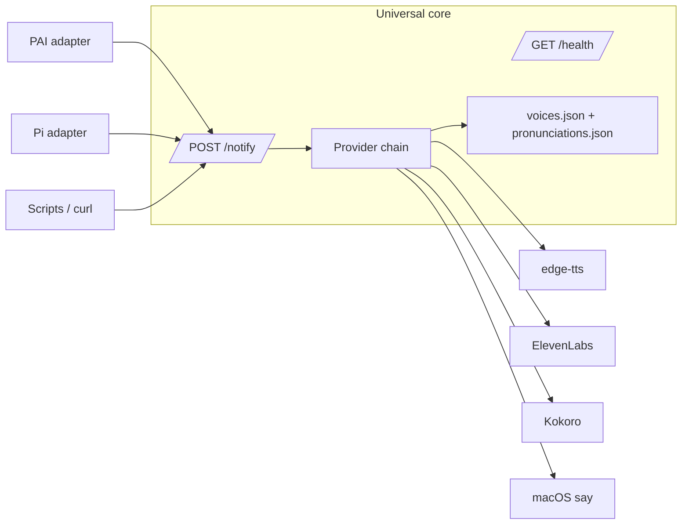

# atlas-voicesystem

Standalone, multi-provider TTS notification server for coding agents, terminals, and scripts.

The server core accepts JSON on `localhost:8888` and speaks through a provider chain (`edge-tts → ElevenLabs → Kokoro → macOS say`). Host-specific lifecycle behavior now lives in adapters:

- `adapters/pai/` — PAI/Claude hook integration.
- `adapters/pi/` — Pi extension package integration.
- direct HTTP — any process can POST to `/notify`.

## Architecture



The universal core is in `core/`. It should not import host adapters or assume PAI, Pi, or any other harness.

## Install

For humans: `docs/install-human.md`.

For autonomous agents: `docs/install-agent.md`.

Quick core-only install:

```bash
bash scripts/install.sh --adapter none
```

Install with PAI hooks:

```bash
bash scripts/install.sh --adapter pai
```

Install with Pi adapter:

```bash
bash scripts/install.sh --adapter pi
```

## Operation

```bash
bash scripts/status.sh
bash scripts/restart.sh
bash scripts/stop.sh
bash scripts/start.sh
```

Manual health check:

```bash
curl -fsS http://localhost:8888/health
```

Manual speak request:

```bash
curl -X POST http://localhost:8888/notify \
  -H 'Content-Type: application/json' \
  -d '{"message":"Hello from atlas voicesystem"}'
```

Silent smoke request:

```bash
curl -fsS -X POST http://localhost:8888/notify \
  -H 'Content-Type: application/json' \
  -d '{"message":"smoke","voice_enabled":false}'
```

## API

### `POST /notify`

```json
{
  "title": "Voice Notification",
  "message": "Task complete",
  "voice_enabled": true,
  "voice_id": "kai",
  "voice_settings": {
    "stability": 0.5,
    "similarity_boost": 0.75,
    "style": 0.0,
    "speed": 1.0,
    "use_speaker_boost": true
  },
  "session_id": "optional-host-session-id",
  "source": "optional-host-name"
}
```

All fields are optional except `message`. `voice_enabled: false` keeps the notification path silent for smoke tests.

### `POST /notify/personality`

Compatibility endpoint for callers that only provide a `message`.

### `GET /health`

Returns provider status, fallback order, circuit-breaker state, pronunciation rule count, and emotional preset count.

## Development

See `docs/development.md`.

```bash
bun test
PORT=8889 tests/smoke-core.sh
```

## Dependency graph

See `docs/dependencies.md` for required runtime dependencies, optional TTS providers, and optional host adapters.

## PAI migration notes

See `MIGRATIONS.md`. Existing deep-path files under `claudecode/.claude/PAI/USER/Voice/` are compatibility wrappers or legacy config surfaces while installs migrate to `core/` + `adapters/`.

## Contributing

See `CONTRIBUTING.md`, especially the "Adding a Host Adapter" section.
