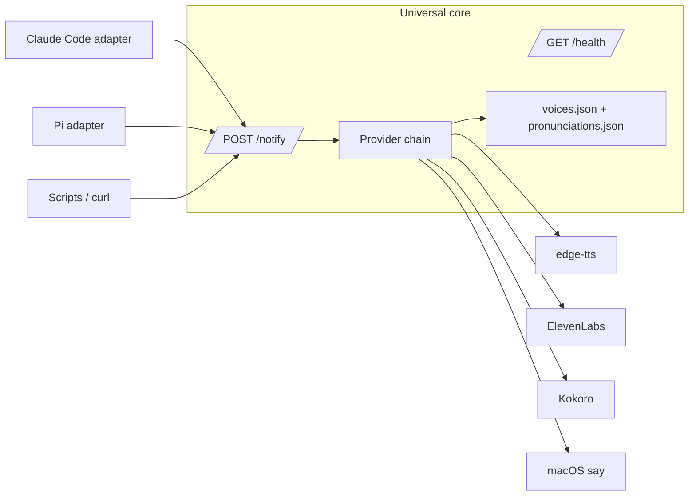

# atlas-echo

Standalone, multi-provider TTS notification server for coding agents, terminals, and scripts.

The server core accepts JSON on `localhost:8888` and speaks through a provider chain (`edge-tts → ElevenLabs → Kokoro → macOS say`). Host-specific lifecycle behavior now lives in adapters:

- `adapters/claudecode/` — Claude Code hook integration.
- `adapters/pi/` — Pi extension package integration.
- direct HTTP — any process can POST to `/notify`.

## Architecture



The universal core is in `core/`. It should not import host adapters or assume PAI, Pi, or any other harness.

## Install

For humans: `docs/install-human.md`.

For autonomous agents: `docs/install-agent.md`.

Quick core-only install:

```bash
bash scripts/install.sh --adapter none
```

Install with Claude Code hooks:

```bash
bash scripts/install.sh --adapter claudecode
```

Install with Pi adapter:

```bash
bash scripts/install.sh --adapter pi
```

## Operation

```bash
bash scripts/status.sh
bash scripts/restart.sh
bash scripts/stop.sh
bash scripts/start.sh
```

Manual health check:

```bash
curl -fsS http://localhost:8888/health
```

Manual speak request:

```bash
curl -X POST http://localhost:8888/notify \
  -H 'Content-Type: application/json' \
  -d '{"message":"Hello from atlas echo"}'
```

Silent smoke request:

```bash
curl -fsS -X POST http://localhost:8888/notify \
  -H 'Content-Type: application/json' \
  -d '{"message":"smoke","voice_enabled":false}'
```

## API

### `POST /notify`

```json
{
  "title": "Voice Notification",
  "message": "Task complete",
  "voice_enabled": true,
  "voice_id": "atlas",
  "voice_settings": {
    "stability": 0.5,
    "similarity_boost": 0.75,
    "style": 0.0,
    "speed": 1.0,
    "use_speaker_boost": true
  },
  "session_id": "optional-host-session-id",
  "source": "optional-host-name"
}
```

All fields are optional except `message`. `voice_enabled: false` keeps the notification path silent for smoke tests.

`voice_id` takes a persona **name key** from `voices.json` (e.g. `kai`, `themis`). The main Atlas voice is the default — it plays whenever `voice_id` is omitted or doesn't match a configured agent (so `"atlas"` above resolves to that default). See **Voices** for resolution order.

### `POST /notify/personality`

Compatibility endpoint for callers that only provide a `message`.

### `GET /health`

Returns provider status, fallback order, circuit-breaker state, pronunciation rule count, and emotional preset count.

Each provider entry includes an egress audit — `enabled`, `healthy`, and `wouldEgress` (with `egressTarget` when it's true). A **disabled provider makes zero outbound calls** (no synthesis request, no auth/health probe) and always reports `wouldEgress: false`. Note that the default provider, `edge-tts`, is an **online** Microsoft service, so it *does* egress when enabled — for a fully-local setup, run `kokoro` (local endpoint) or `say` and disable `edgetts`/`elevenlabs`.

### Voice-resolution drop-off log

To make it observable *why* a `/notify` used the voice it did, the daemon appends **one structured JSONL event per voice-enabled `/notify`** to a machine-readable log — separate from the human-readable daemon log (`~/Library/Logs/atlas-voicesystem.log`).

- **Path:** `~/Library/Logs/atlas-voicesystem/voice-resolution.jsonl` on macOS (else `$XDG_STATE_HOME` or `~/.local/state` under `atlas-voicesystem/`). Override with `VOICESYSTEM_RESOLUTION_LOG`.
- **Retention:** single size-capped file (`~1MB`, override `VOICESYSTEM_RESOLUTION_LOG_MAX_BYTES`). On each write, oldest whole lines are pruned to stay under the cap (newest always kept) — no logrotate, no time-based rotation.
- **Best-effort:** a write failure is swallowed and never breaks a notification.

Each line:

```json
{
  "ts": "2026-06-23T13:16:16.822Z",
  "requested_voice_id": "themis",
  "resolution": "agent-key",
  "provider": "edgetts",
  "voice": "en-US-MichelleNeural",
  "hops": 0,
  "attempts": [{ "provider": "edgetts", "outcome": "success" }],
  "success": true
}
```

| Field | Meaning |
|---|---|
| `requested_voice_id` | The `voice_id` the caller sent (`null` if omitted). |
| `resolution` | How it resolved: `identity-default` (none requested), `identity`, `agent-key`, `elevenlabs-id`, or `fallback`. |
| `resolution_reason` | Present only when `resolution` is `fallback` — why the id didn't resolve. |
| `provider` | Provider that actually spoke, or `none` if all failed. |
| `voice` | Actual provider voice used (`null` on total failure). |
| `hops` | Providers skipped/failed before the chosen one (`0` = primary spoke first try). |
| `attempts` | Per-provider outcome trail: `success` \| `failed` \| `unhealthy` \| `circuit-open` \| `disabled`. |
| `success` | Whether any provider spoke. |

## Voices

Voices are configured per agent in `core/voices.json`. The `identity` mapping is the default ("Atlas") voice; every entry under `agents` is a named persona keyed by a short lowercase name (`engineer`, `architect`, `themis`, `clauderesearcher`, …). Select one by sending `"voice_id": "<key>"`.

**Resolution order** (`getVoiceMapping` in `core/server.ts`): the `voice_id` is matched against (1) an `agents` **name key**, then (2) any agent's `elevenlabs.voice_id`, then (3) the `identity` voice; no match falls back to the active provider's default voice. So callers should send the **name key** (e.g. `"themis"`), not a raw provider voice id.

For the default `edge-tts` provider, each agent maps to a Microsoft neural voice with an optional `speed` (a multiplier converted to edge-tts's `--rate`, e.g. `1.08 → +8%`, `0.94 → -6%`). A `speed` of `1.0` (or no `edgetts` block) uses the global `providers.edgetts.rate`.

```json
"engineer": {
  "edgetts": { "voice": "en-GB-ThomasNeural", "speed": 0.94 }
}
```

### Change a persona's voice

1. Audition voices by ear (see below) and confirm the target voice name exists: `bun scripts/preview-voices.ts --list`.
2. Edit that agent's `edgetts.voice` (and optional `speed`) in `core/voices.json`.
3. Reload the daemon so it re-reads the config:
   ```bash
   launchctl kickstart -k "gui/$UID/com.atlas.voicesystem"
   ```
4. Verify: `curl -fsS -X POST http://localhost:8888/notify -H 'Content-Type: application/json' -d '{"message":"voice check","voice_id":"<key>","voice_enabled":true}'`.

### Add a voice or persona

1. **Add the entry** to `agents` in `core/voices.json`, keyed by a new lowercase name. Mirror an existing entry — `description`, optional `catchphrase`, and at least an `edgetts` block (add `kokoro` for parity). Pick a voice not already in use and validate it exists with `--list`. Reload the daemon as above.
2. **Bind the persona to that key.** An agent/persona only speaks in its voice if its brief tells it to send the key. In the agent definition (`~/.claude/agents/<Name>.md`, sourced from the `atlas-config` repo):
   - set frontmatter `voiceId: <key>`, and
   - make every self-voice `curl` POST to `http://localhost:8888/notify` with `"voice_id":"<key>"`.

   Gotchas that cause silence: an agent's frontmatter is **not** visible in its own prompt, so the self-voice instruction must live in the brief **body**; sending a raw ElevenLabs id (instead of the name key) won't resolve while ElevenLabs is disabled; and port `31337` is wrong — voice traffic is `:8888`.

### Per-turn persona voice (Claude Code Stop hook)

Beyond explicit self-voice `curl`s, the Claude Code adapter speaks the response's voice line automatically at the end of every turn via the Stop hook `adapters/claudecode/hooks/VoiceCompletion.hook.ts`. This hook is **persona-aware**: it reads the active speaker from the response's trailing `🗣️ <Name>:` line and sends that lowercase name as the `voice_id`. So when you adopt a main-session persona (e.g. `/Themis`), each turn is spoken in the persona's voice (`themis` → Michelle), not the default Atlas voice. When the speaker is Atlas, or there is no `🗣️` line, it uses the default voice — the Atlas path is unchanged.

The signal is the response itself — no marker files, env vars, or registries — so the moment you stop using a persona, the voice reverts to Atlas on the next turn. For a persona to be voiced this way, its turns must include a `🗣️ <Persona>:` line (the standard response format already does). The hook is registered into `~/.claude/settings.json` by `bash scripts/install.sh --adapter claudecode` (which runs `restore-hooks.ts`); it replaces any older unmanaged `~/.claude/hooks/VoiceCompletion.hook.ts`.

### Auditioning edge voices

`scripts/preview-voices.ts` plays short samples so you can choose voices by ear before editing `voices.json`. It calls `edge-tts` directly and is dev tooling — not part of the runtime request path.

```bash
bun scripts/preview-voices.ts --list                                # list English voices, no audio
bun scripts/preview-voices.ts --locale en-GB                        # audition all en-GB voices
bun scripts/preview-voices.ts --voices en-GB-RyanNeural,en-GB-ThomasNeural
bun scripts/preview-voices.ts --voices en-GB-ThomasNeural --rate -6%
bun scripts/preview-voices.ts --dry-run --voices en-GB-RyanNeural   # print synth command, no audio
```

| Flag | Purpose | Default |
|---|---|---|
| `--locale` | Comma-separated locale prefixes to audition | `en-US,en-GB,en-AU,en-IE` |
| `--voices` | Explicit voice ids (overrides `--locale`) | — |
| `--text` | Sample line spoken (`{voice}` is substituted) | `Hi, I'm {voice}. This is how I sound for Atlas.` |
| `--rate` | edge-tts rate applied to every sample | `+0%` |
| `--list` / `--dry-run` | Print matched voices (and synth command) without playing audio | off |

## Development

See `docs/development.md`.

```bash
bun test
PORT=8889 tests/smoke-core.sh
```

## Dependency graph

See `docs/dependencies.md` for required runtime dependencies, optional TTS providers, and optional host adapters.

## Contributing

See `CONTRIBUTING.md`, especially the "Adding a Host Adapter" section.
